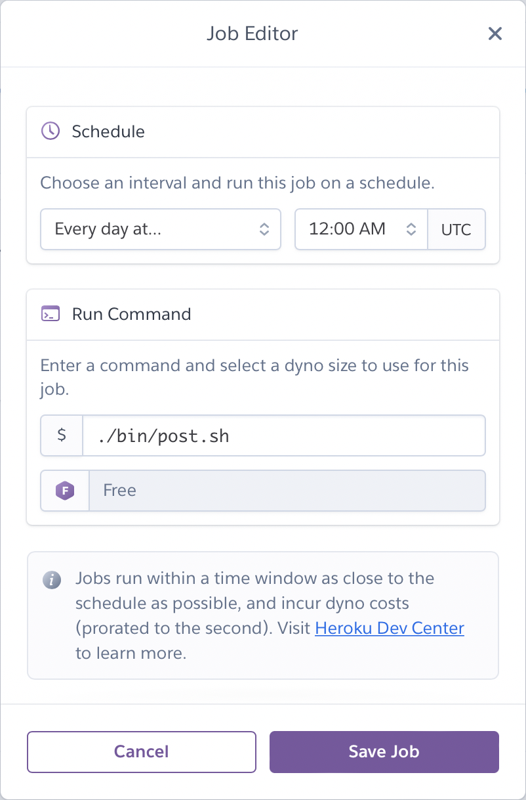
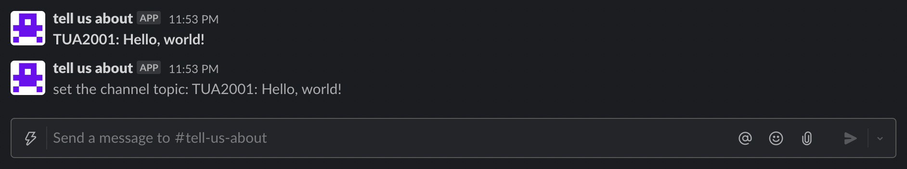

# slack-tell-us-about

Slack app for #tell-us-about

## Deploy

This app is deployed to Heroku using a GitHub Action. The steps below describe the one-time setup needed to enable deploys.

1. Install the Heroku CLI as described in their [docs](https://devcenter.heroku.com/articles/heroku-cli#download-and-install).

```console
me@host:~/code/slack-tell-us-about$ brew tap heroku/brew && brew install heroku
```

2. Login to your Heroku account using the CLI as described in their [docs](https://devcenter.heroku.com/articles/heroku-cli#getting-started).

```console
me@host:~/code/slack-tell-us-about$ heroku login
heroku: Press any key to open up the browser to login or q to exit
 ›   Warning: If browser does not open, visit
 ›   https://cli-auth.heroku.com/auth/browser/***
heroku: Waiting for login...
Logging in... done
Logged in as me@example.com
```

3. Create a new app on Heroku as described in their [docs](https://devcenter.heroku.com/articles/creating-apps).

```console
me@host:~/code/slack-tell-us-about$ heroku create
Creating app... done, ⬢ fast-headland-20836
https://fast-headland-20836.herokuapp.com/ | https://git.heroku.com/fast-headland-20836.git
```

4. Get your Heroku API key to set it as an Action Secret in GitHub.

```console
me@host:~/code/slack-tell-us-about$ less ~/.netrc | grep password | uniq | sed 's/^  password //'
***YOUR API KEY***
```

5. Create three secrets in GitHub as described in their [docs](https://docs.github.com/en/actions/security-guides/encrypted-secrets).

- `HEROKU_API_KEY`: the API key for making requests to Heroku, the output of step 4
- `HEROKU_APP_NAME`: the name of the app on Heroku, the output of step 3
- `HEROKU_EMAIL`: the email address used for Heroku

## Running

We'll use the Heroku CLI to set the environment variables needed for posting to Slack, as described in their [docs](https://devcenter.heroku.com/articles/config-vars).

```console
me@host:~/code/slack-tell-us-about$ heroku config:set PORT=3001
me@host:~/code/slack-tell-us-about$ heroku config:set SLACK_BOT_TOKEN=<YOUR_SLACK_BOT_TOKEN>
me@host:~/code/slack-tell-us-about$ heroku config:set SLACK_CHANNEL_ID=<YOUR_SLACK_CHANNEL_ID>
```

We need to enable the Heroku Labs: Dyno Metadata to be able to access our app name as an environment variable, as described in their [docs](https://devcenter.heroku.com/articles/dyno-metadata).

```console
me@host:~/code/slack-tell-us-about$ heroku labs:enable runtime-dyno-metadata
Enabling runtime-dyno-metadata for fast-headland-20836... done
```

The app posts a prompt to a Slack channel once per day, at a specified time. This is done using Heroku Scheduler and a shell script that calls an endpoint in the service. Create a scheduler as described in their [docs](https://devcenter.heroku.com/articles/scheduler).

```console
me@host:~/code/slack-tell-us-about$ heroku addons:create scheduler:standard
Creating scheduler:standard on ⬢ fast-headland-20836... free
 To manage scheduled jobs run:
 heroku addons:open scheduler

Created scheduler-globular-36001
Use heroku addons:docs scheduler to view documentation
```

Then open the scheduler dashboard to configure it.

```console
me@host:~/code/slack-tell-us-about$ heroku addons:open scheduler
```

Configure the job to run `./bin/post.sh` once per day.



## Manually Trigger a Prompt

To verify the service is running and the configuration is correct, manually trigger a prompt.

```console
me@host:~/code/slack-tell-us-about$ HEROKU_APP_NAME=fast-headland-20836 ./bin/post.sh
```

Check the logs in Heroku to verify the prompt was posted.

```console
me@host:~/code/slack-tell-us-about$ heroku logs --num 100 --tail
2021-12-05T07:53:27.802416+00:00 app[web.1]: 2021-12-05 TUA2001: Hello, world!
2021-12-05T07:53:27.802468+00:00 app[web.1]: [DEBUG]  web-api:WebClient:0 apiCall('chat.postMessage') start
2021-12-05T07:53:27.802661+00:00 app[web.1]: [DEBUG]  web-api:WebClient:0 will perform http request
2021-12-05T07:53:27.865548+00:00 app[web.1]: [DEBUG]  web-api:WebClient:0 http response received
2021-12-05T07:53:27.865616+00:00 app[web.1]: [DEBUG]  web-api:WebClient:0 apiCall('conversations.setTopic') start
2021-12-05T07:53:27.865730+00:00 app[web.1]: [DEBUG]  web-api:WebClient:0 will perform http request
2021-12-05T07:53:27.954400+00:00 app[web.1]: [DEBUG]  web-api:WebClient:0 http response received
2021-12-05T07:53:27.954456+00:00 app[web.1]: Successfully posted to Slack: TUA2001: Hello, world!
2021-12-05T07:53:27.954538+00:00 app[web.1]: POST /rest/post - 153ms
2021-12-05T07:53:27.954638+00:00 heroku[router]: at=info method=POST path="/rest/post" host=fast-headland-20836.herokuapp.com request_id=4c479527-34bf-453e-bb40-8fe24f403bc2 fwd="73.71.137.41" dyno=web.1 connect=0ms service=154ms status=200 bytes=137 protocol=http
```

And the prompt should be posted to Slack.


